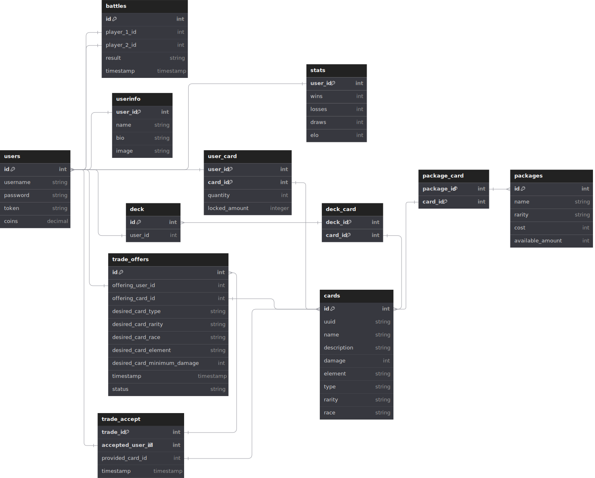

# Monster Trading Card Game
This is not as well polished as i'd want it to be but it'll have to do for now.

## Github Link
[Monster Trading Card Game](https://github.com/lkalchhauser/MTCG)

## Short Description
This is a simple REST based backend server for a monster trading card game.
It implements different methods and paths to interact with the server and play the game.

## Unique Feature
### Updating the user password
Users can update their password by using the POST route `/users/password` with their new password contained in the body.

Example:
```JSON
{
    "Password": "newpassword"
}
```

The user has to be authenticated. When the password is changed, the current token is reset for security reasons and the user has to login again.

### Deleting the User Data
Users can delete their current user data by calling DELETE `/users/userinfo` while being authenticated with their token.

### Other
#### Plain Format Scoreboard
When requesting a score board via GET `/scoreboard`, the user can add `?format=plain` to get a nicely formatted table.

#### Battle Log Format
When requesting a battle board via POST `/battles`, the user can add `?format=plain` to get a nicely formatted table of the battle log.

#### Extra Card Races and Battle Rules
Additionally to the in the specification defined races/classes, there are 4 new ones (Slime, Demon, Oni, Human). These are also all used in special rules:

- Demon manipulates a Human -> Demon Wins
- Slime is invincible against Oni -> Slime Wins

#### Extra Card Elements and Elemental Rules
Additionally to the defined elements, there are also two new ones, Earth and Air. The elemental superiority is defined as follows:

- Water -> Fire
- Fire -> Air
- Fire -> Normal
- Earth -> Water
- Air -> Earth
- Normal -> Water

In the other direction the element is weak (it's only applied once).

#### Package and Card Rarity
Cards have a rarity rating, which looks like the following:

- NORMAL
- RARE
- EPIC
- LEGENDARY
- MYTHIC

Packs also have the same ratings, depending on how many of each rarity are in the pack.

## Unit Testing
For unit tests i mainly focused on the services in the server, since those are the main functional component of the program.

Since all services and repositories have their own interfaces, it was easy to mock everything needed.

The tests are contained in a separate project called "MTCG.Tests", each service has its own tests file. I mainly focused on testing the functionality of each method on its own. For this i had to use a lot of mocking, especially when it comes to using the repositories. At the beginning of the test i mocked all the responses i needed (mainly from other services and repositories) and then tested specific cases.

### Current Number of Tests
- BattleServiceTests: 24
- CardServiceTests: 11
- DeckServiceTests: 4
- HelperServiceTests: 9
- TradeServiceTests: 13
- TransactionServiceTests: 5
- UserServiceTests: 22

## Integration Tests
The integration tests were made with Postman. You can find the Postman Collection with all requests in the `doc/integrationTests` folder.

I have also created a flow that resembles the original bat file. Sadly, postman does not allow exporting the flow yet so i can only add collaborators by mail.

## Database


You can also find the Database.dbdiagram file in the doc folder, which describes the database.

## Tracked Time
- 40 Hours (estimated)
