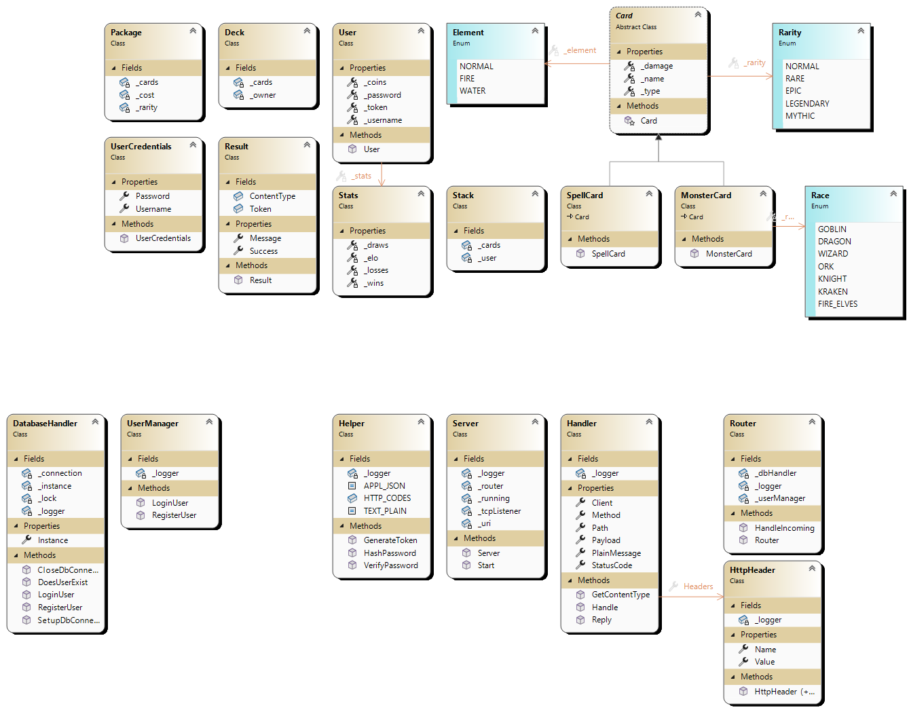

# Monster Trading Card Game
## Github Link
[Monster Trading Card Game](https://github.com/lkalchhauser/MTCG)

## Description
This is a simple REST based backend server for a monster trading card game.
It implements different methods and paths to interact with the server and play the game.

## Structure
The project is seperated into different parts:

### HTTP Server
The HTTP server is implemented using the TcpListener from the standard .NET library. It listens on port 10001 for incoming requests.
The server is able to handle different HTTP methods like GET, POST, PUT and DELETE, and routes them to the correct handler.

Currently, the following routes are implemented:
- GET /: Returns a simple welcome message
- POST /users: Creates a new user
- POST /sessions: Logs the user in

### Functionality
Currently, the testing script (MonsterTradingCards.exercise.curl.bat) can be used to register new users and log them in.
#### User Management
Users can be created and logged in. When creating a user, the user data is verified (no existing user, ...), the password is hashed and stored in the database.
When logging in, the password is hashed and compared to the stored hash. If the password is correct, a token is created, saved in the database and returned to the user (response).
#### Database Management
Currently, a postgres database is implemented. When starting the application, the database is reset and all tables are created (currently only user).

### Class Diagram
